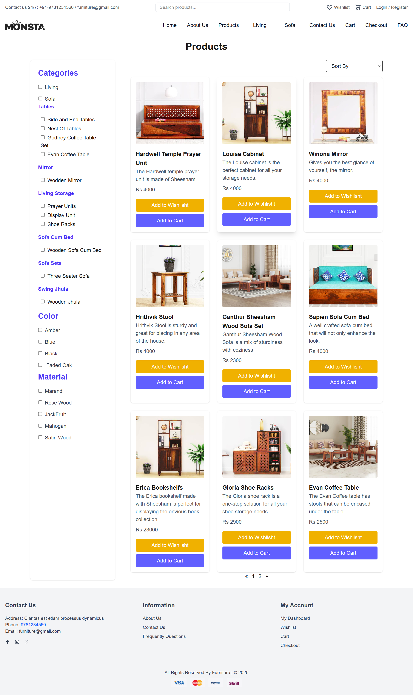

# 🛒 Furniture E-commerce Website

A full-stack E-commerce web application built using the MERN stack. This platform allows users to browse furniture products, add items to cart, and securely complete purchases using Razorpay payment integration.

## 🚀 Live Demo
https://monsta-furniture-front.onrender.com/

## 📌 Features
- User Authentication & Authorization (JWT)
- Product listing and filtering
- Add to cart functionality
- Secure checkout process
- 💳 Online payment integration (Razorpay)
- RESTful API integration
- Fully responsive UI

## 💳 Payment Integration
- Integrated Razorpay for secure online transactions
- Handles payment verification and order processing
- Ensures safe and seamless checkout experience

## 🛠️ Tech Stack
- Frontend: Next.js (React), HTML, CSS, JavaScript
- Backend: Node.js, Express.js
- Database: MongoDB
- Authentication: JWT
- Payment Gateway: Razorpay
- Deployment: Render

## 📸 Screenshots

### 🏠 Homepage


### 🛍️ Products Page


## ⚙️ Setup

```bash
git clone https://github.com/suryadevaraBalakrishna/Monsta-Furniture.git
cd Monsta-Furniture
npm install
npm run dev
